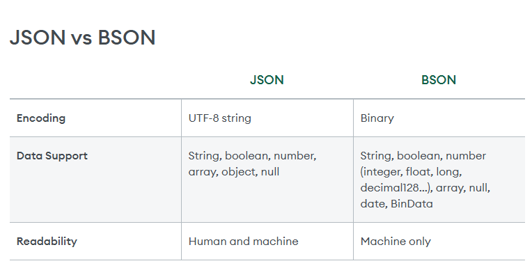

## Command List
```
 Database Class:

    getMongo                                   Returns the current database connection
    getName                                    Returns the name of the DB
    getCollectionNames                         Returns an array containing the names of all collections in the current database.
    getCollectionInfos                         Returns an array of documents with collection information, i.e. collection name and options, for the current database.
    runCommand                                 Runs an arbitrary command on the database.
    adminCommand                               Runs an arbitrary command against the admin database.
    aggregate                                  Runs a specified admin/diagnostic pipeline which does not require an underlying collection.
    getSiblingDB                               Returns another database without modifying the db variable in the shell environment.
    getCollection                              Returns a collection or a view object that is functionally equivalent to using the db.<collectionName>.
    dropDatabase                               Removes the current database, deleting the associated data files.
    createUser                                 Creates a new user for the database on which the method is run. db.createUser() returns a duplicate user error if the user already exists on the database.
    updateUser                                 Updates the user’s profile on the database on which you run the method. An update to a field completely replaces the previous field’s values. This includes updates to the user’s roles array.
    changeUserPassword                         Updates a user’s password. Run the method in the database where the user is defined, i.e. the database you created the user.
    logout                                     Ends the current authentication session. This function has no effect if the current session is not authenticated.
    dropUser                                   Removes the user from the current database.
    dropAllUsers                               Removes all users from the current database.
    auth                                       Allows a user to authenticate to the database from within the shell.
    grantRolesToUser                           Grants additional roles to a user.
    revokeRolesFromUser                        Removes a one or more roles from a user on the current database.
    getUser                                    Returns user information for a specified user. Run this method on the user’s database. The user must exist on the database on which the method runs.
    getUsers                                   Returns information for all the users in the database.
    createCollection                           Create new collection
    createEncryptedCollection                  Creates a new collection with a list of encrypted fields each with unique and auto-created data encryption keys (DEKs). This is a utility function that internally utilises ClientEnryption.createEncryptedCollection.
    createView                                 Create new view
    createRole                                 Creates a new role.
    updateRole                                 Updates the role’s profile on the database on which you run the method. An update to a field completely replaces the previous field’s values.
    dropRole                                   Removes the role from the current database.
    dropAllRoles                               Removes all roles from the current database.
    grantRolesToRole                           Grants additional roles to a role.
    revokeRolesFromRole                        Removes a one or more roles from a role on the current database.
    grantPrivilegesToRole                      Grants additional privileges to a role.
    revokePrivilegesFromRole                   Removes a one or more privileges from a role on the current database.
    getRole                                    Returns role information for a specified role. Run this method on the role’s database. The role must exist on the database on which the method runs.
    getRoles                                   Returns information for all the roles in the database.
    currentOp                                  Runs an aggregation using $currentOp operator. Returns a document that contains information on in-progress operations for the database instance. For further information, see $currentOp.
    killOp                                     Calls the killOp command. Terminates an operation as specified by the operation ID. To find operations and their corresponding IDs, see $currentOp or db.currentOp().
    shutdownServer                             Calls the shutdown command. Shuts down the current mongod or mongos process cleanly and safely. You must issue the db.shutdownServer() operation against the admin database.
    fsyncLock                                  Calls the fsync command. Forces the mongod to flush all pending write operations to disk and locks the entire mongod instance to prevent additional writes until the user releases the lock with a corresponding db.fsyncUnlock() command.
    fsyncUnlock                                Calls the fsyncUnlock command. Reduces the lock taken by db.fsyncLock() on a mongod instance by 1.
    version                                    returns the db version. uses the buildinfo command
    serverBits                                 returns the db serverBits. uses the buildInfo command
    isMaster                                   Calls the isMaster command
    hello                                      Calls the hello command
    serverBuildInfo                            returns the db serverBuildInfo. uses the buildInfo command
    serverStatus                               returns the server stats. uses the serverStatus command
    stats                                      returns the db stats. uses the dbStats command
    hostInfo                                   Calls the hostInfo command
    serverCmdLineOpts                          returns the db serverCmdLineOpts. uses the getCmdLineOpts command
    rotateCertificates                         Calls the rotateCertificates command
    printCollectionStats                       Prints the collection.stats for each collection in the db.
    getProfilingStatus                         returns the db getProfilingStatus. uses the profile command
    setProfilingLevel                          returns the db setProfilingLevel. uses the profile command
    setLogLevel                                returns the db setLogLevel. uses the setParameter command
    getLogComponents                           returns the db getLogComponents. uses the getParameter command
    cloneDatabase                              deprecated, non-functional
    cloneCollection                            deprecated, non-functional
    copyDatabase                               deprecated, non-functional
    commandHelp                                returns the db commandHelp. uses the passed in command with help: true
    listCommands                               Calls the listCommands command
    getLastErrorObj                            Calls the getLastError command
    getLastError                               Calls the getLastError command
    printShardingStatus                        Calls sh.status(verbose)
    printSecondaryReplicationInfo              Prints secondary replicaset information
    getReplicationInfo                         Returns replication information
    printReplicationInfo                       Formats sh.getReplicationInfo
    printSlaveReplicationInfo                  DEPRECATED. Use db.printSecondaryReplicationInfo
    setSecondaryOk                             This method is deprecated. Use db.getMongo().setReadPref() instead
    watch                                      Opens a change stream cursor on the database
    sql                                        (Experimental) Runs a SQL query against Atlas Data Lake. Note: this is an experimental feature that may be subject to change in future releases.
    checkMetadataConsistency                   Returns a cursor with information about metadata inconsistencies
```
