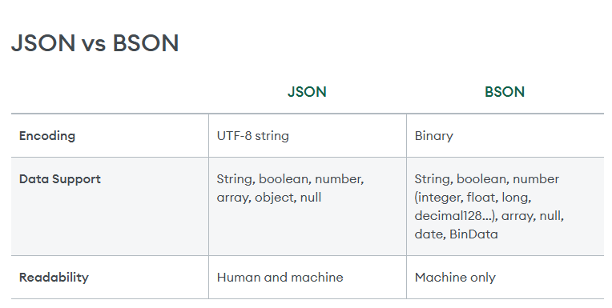

# Understanding MongoDB Structure

```py
MongoDB Server
      │
      ├── Database
      │      │
      │      ├── Collection
      │      │       │
      │      │       ├── Document
      │      │       └── Document
      │      │
      │      └── Collection
      │
      └── Database
```



