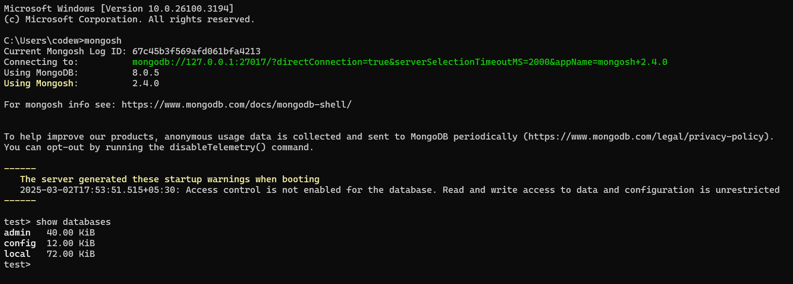

# mongo DB master guide

## what is database ?

A database is an organized collection of data that is stored and managed in a way that allows easy access, retrieval, updating, and deletion of information. It helps users and applications efficiently store and manipulate large amounts of data.

- SQL Database : table

- NoSQL Database : collection with json document

# setup mongoDb

> https://www.mongodb.com/try/download/community

> https://www.mongodb.com/try/download/shell

 

  
