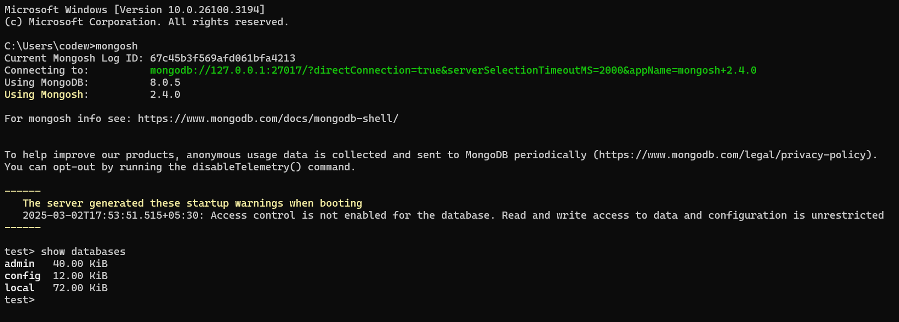

# mongodb master guide

# what is database ?

**A database is an organized collection of data that is stored and managed in a way that allows easy access, retrieval, updating, and deletion of information. It helps users and applications efficiently store and manipulate large amounts of data.**

- SQL Database : tables

- NoSQL Database : documents

# What is MongoDB?

**MongoDB is an open-source, NoSQL, document-oriented database designed to store and process large amounts of flexible, semi-structured data. Unlike traditional relational databases that store data in tables and rows, MongoDB stores data as documents in a BSON format.**

| Feature | SQL | MongoDB / NoSQL |
|---|---|---|
| Data model | Tables | Documents |
| Structure | Fixed schema | Flexible schema |
| Data unit | Row | Document |
| Relationships | Foreign keys | Embedded/reference documents |
| Query language | SQL | MongoDB Query API |
| Scaling | Mainly vertical | Horizontal + vertical |
| Schema changes | Usually structured migrations | More flexible |
| Example | MySQL | MongoDB |

## MongoDB use cases

- Web applications
- Mobile applications
- E-commerce
- Content management systems
- Real-time applications
- IoT applications
- Analytics
- Catalog management
- Social media applications

# setup mongoDb

> https://www.mongodb.com/try/download/community

> https://www.mongodb.com/try/download/shell

 

# MongoDB

## Introduction to MongoDB

- Installing MongoDB

- The current SQL/NoSQL landscape

- Document-oriented vs. other types of storage

- Mongo's featureset

- Common use-cases

- MongoDB databases

- MongoDB Collections

- MongoDB Documents

  
